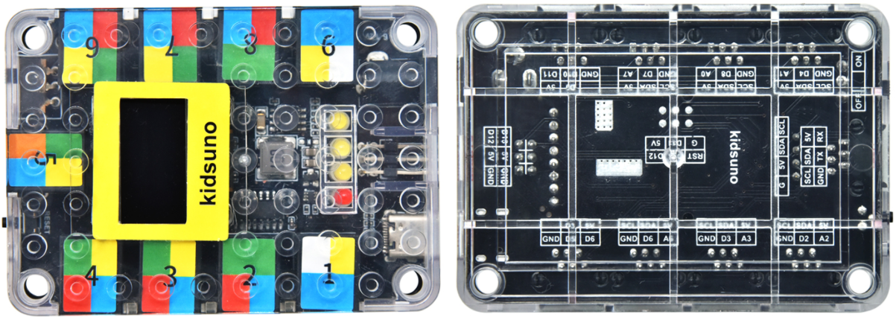
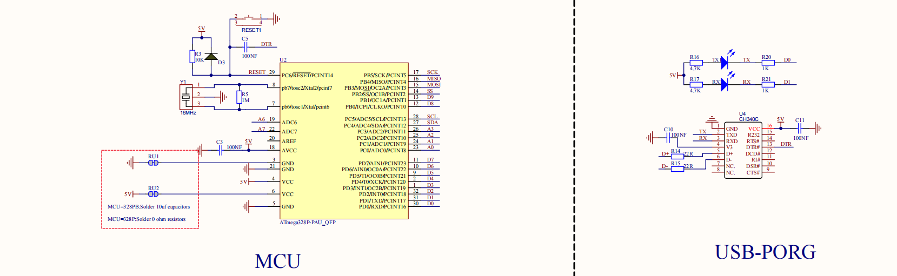
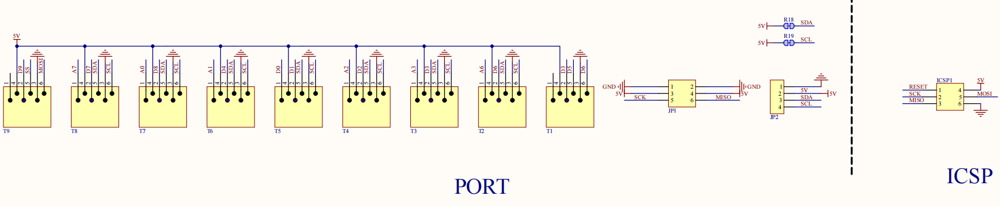
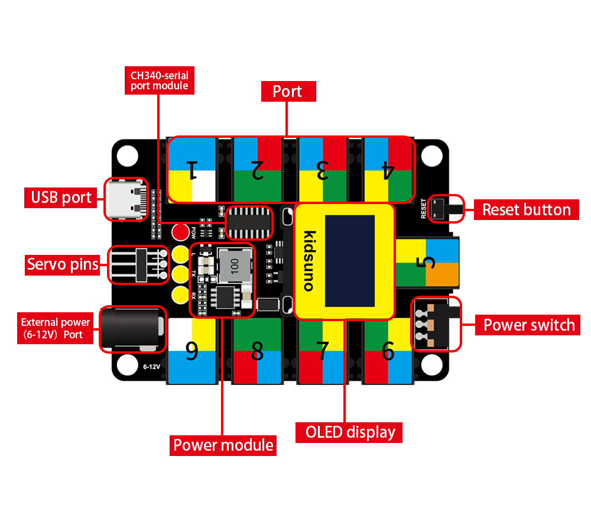
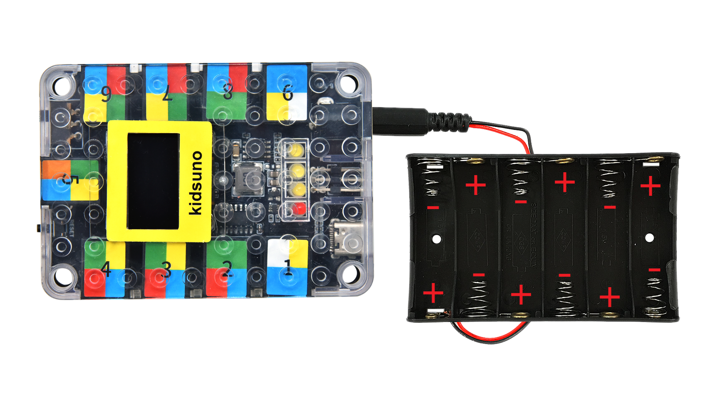

# Arduino STEM electronic building block

## 1. Introduction：

Arduino STEM electronic building block programming development controller is a board based on the ATmega328P microcontroller. It boasts 14 digital input or output pins (6 of which can be used as PWM output), 8 analog inputs (A4 and A5 as fixed I2C), two row pin ports, a USB port, a DC power port, a DC power switch, a reset button and a 128*64OLED display.
Importantly, we enable to connect it to a computer via a USB-C cable, or use a DC adapter or batteries to power it.

## 2. Parameters：

- Microcontroller：ATmega328P
- Operating Voltage：5V
- Input Voltage：USB:5V,DC:6-12V
- Digital I/O Pins：14(of which 6 provide PWM output
- PWM Digital I/O Pins：6
- Analog Input Pins：8（A4 and A5 as fixed I2C）
- DC Current per I/O Pin：20mA
- Flash Memory：32KB(ATmega328P)of which 0.5 KB used by bootloader
- SRAM：2KB(ATmega328P)
- EEPROM：1KB(ATmega328P)
- Total Current： The max output of USB power supply is 400mA，and DC is 1.6A
- Max Power：8W
- Clock Speed：16MHZ
- Dimensions：87.5mm×60mm×20mm
- Weight：37g(without housing)
- Operating Temperature Range：-10℃~50℃ 

## 3. Schematic Diagram：

## 4. Ports Description of Kidsuno Mainboard

## 5. Mainboard External Battery Holder

The end of the battery holder with the spring is negative pole (-), and the other is positive pole (+). (AA batteries are not provided)

